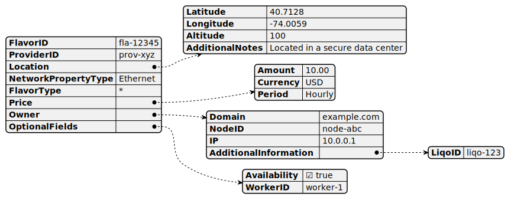
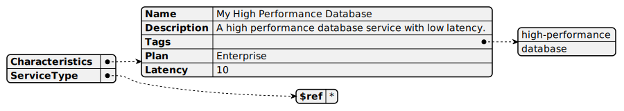
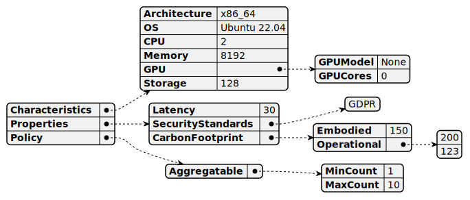
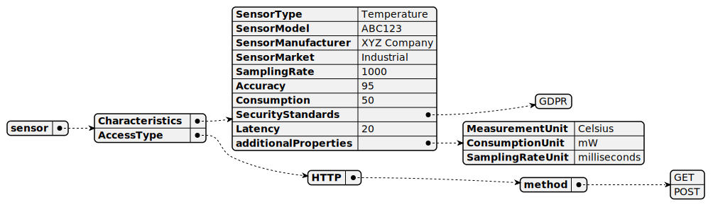

```
DISCLAIMER #1: The content of this document is automatically generated upon pushing the files on GitHub. 
The generation starts from the JSON schema and examples contained in the repository. 
Do not try to modify this document, just the JSON files.
```
```
DISCLAIMER #2: Still, the generation of examples of JSONs (starting from the schema) is not automated yet. 
Therefore, we suggest to use tools like ChatGPT or Gemini, providing the JSON schema to the prompt and asking for an example of compliant JSON.
```
In the following we represent some examples of JSON, you can find the original JSON schemas [here](models/schemas).

# Flavor

- **FlavorID**. The unique identifier for a flavor ['string']
- **ProviderID**. The unique identifier for a provider ['string']
- **Timestamp**. Timestamp of the provided Flavor offer. It allows to advertise Flavors in the (near) future ['string']
- **Location**:
  - **Latitude**. Latitude of the location ['string']
  - **Longitude**. Longitude of the location ['string']
  - **Altitude**. Altitude of the location expressed in meters ['string']
  - **AdditionalNotes**. Additional notes about the location ['string']
- **NetworkPropertyType**. Type of network property ensured by the privider (e.g., 5G, Wifi, Ethernet) ['string']
- **FlavorType**. A reference to a specific flavor type schema using JSON references ($ref) to external files like 'k8slice.json', 'vm.json', etc. This allows defining details specific to each flavor type.
- **Price**:
  - **Amount**. Amount of the price. ['string']
  - **Currency**. Currency of the price. ['string']
  - **Period**. Period of the price. ['string']
- **Owner**:
  - **Domain**. Domain of the node. ['string']
  - **NodeID**. ID of the node. ['string']
  - **IP**. IP of the node. ['string']
  - **AdditionalInformation**:
    - **LiqoID**. Liqo ID of the node. ['string']
- **OptionalFields**:
  - **Availability**. Availability flag of the Flavor. ['boolean']
  - **WorkerID**. ID of the worker that provides the Flavor. ['string']
- **AdditionalInfo**. Additional information to enrich the Flavor description using a key: value representation. ['string']

# FlavorType
The FlavorType describes the actual flavor that is adverised.

## k8slice

- **Characteristics**:
  - **CPU**. The number of CPU cores ['integer']
  - **Pods**. The number of pods ['integer']
  - **Memory**. The amount of memory ['integer']
  - **GPU**:
    - **GPUModel**. The model of the GPU offered for the specific Flavor. ['string']
    - **GPUCores**. The number of GPU cores advertised by the Flavor. ['integer']
  - **Storage**. The amount of storage ['integer']
- **Properties**:
  - **Latency**. The latency of the Flavor. ['integer']
  - **SecurityStandards**. Security standards supported by the Flavor (e.g., GDPR). ['array']
  - **CarbonFootprint**:
    - **Embodied**. Embodied carbon of the node hardware normalized by its expected lifetime. ['integer']
    - **Operational**. Forecasted average carbon intensity of the node for the next N windows/hours. ['array']
- **Policy**:
  - **Aggregatable**:
    - **MinCount**. Minimum required number of instances of the Flavor. ['integer']
    - **MaxCount**. Maximum required number of instances of the Flavor. ['integer']
  - **Partitionable**:
    - **CpuMin**. Minimum required number of CPU cores of the Flavor. ['integer']
    - **MemoryMin**. Minimum required amount of RAM of the Flavor. ['integer']
    - **CpuStep**. Incremental value of CPU cores of the Flavor. ['integer']
    - **MemoryStep**. Incremental value of RAM of the Flavor. ['integer']

## service

- **Characteristics**:
  - **Name**. Name of the flavor. ['string']
  - **Description**. Description of the flavor. ['string']
  - **Tags**. Tags associated with the flavor. ['array']
  - **Plan**. Plan of the flavor. ['string']
  - **Latency**. The latency of the Flavor. ['integer']
  - **SecurityStandards**. Security standards supported by the Flavor (e.g., GDPR). ['array']
- **ServiceType**. ServiceType to describe the specific characteristics of the advertised flavor.

## vm

- **Characteristics**:
  - **Architecture**. Architecture of the Flavor. ['string']
  - **OS**. The Operating System of the advertised VM ['string']
  - **CPU**. Number of CPU cores of the Flavor. ['integer']
  - **Memory**. Amount of RAM of the Flavor. ['integer']
  - **GPU**:
    - **GPUModel**. The model of the GPU offered for the specific Flavor. ['string']
    - **GPUCores**. The number of GPU cores advertised by the Flavor. ['integer']
  - **Storage**. The amount of storage ['integer']
- **Properties**:
  - **Latency**. The latency of the Flavor. ['integer']
  - **SecurityStandards**. Security standards supported by the Flavor (e.g., GDPR). ['array']
  - **CarbonFootprint**:
    - **Embodied**. Embodied carbon of the node hardware normalized by its expected lifetime. ['integer']
    - **Operational**. Forecasted average carbon intensity of the node for the next N windows/hours. ['array']
- **Policy**:
  - **Aggregatable**:
    - **MinCount**. Minimum required number of instances of the Flavor. ['integer']
    - **MaxCount**. Maximum required number of instances of the Flavor. ['integer']

## sensor

- **Characteristics**:
  - **SensorType**. The type of sensor ['string']
  - **SensorModel**. The model of sensor ['string']
  - **SensorManufacturer**. The manufacturer of sensor ['string']
  - **SensorMarket**. The market of sensor ['string']
  - **SamplingRate**. The sampling rate of the sensor in milliseconds ['integer']
  - **Accuracy**. The accuracy reported for the measurements (unit percentage) ['integer']
  - **Consumption**. The power consumption of the reported sensor (unit mW) ['integer']
  - **Interface**. Not clear what that means. ['string']
  - **SecurityStandards**. Security standards supported by the Flavor (e.g., GDPR). ['array']
  - **Latency**. The latency of the Flavor. ['integer']
  - **additionalProperties**:
    - **MeasurementUnit**. The unit of measure for the measurements ['string']
    - **ConsumptionUnit**. The unit of measure for the sensor power consumption ['string']
    - **SamplingRateUnit**. The unit of measure for the sampling rate ['string']
    - **AccessProtocol**. Not sure what that means ['string']
- **AccessType**. The access type of the sensor. Currently, HTTP and MQTT are supported.