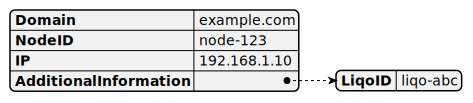
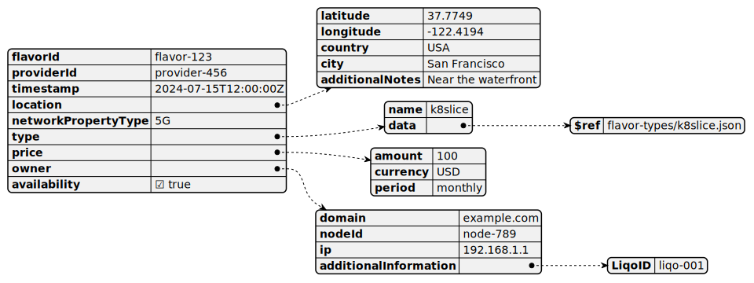

```
DISCLAIMER #1: The content of this document is automatically generated upon pushing the files on GitHub. 
The generation starts from the JSON schema and examples contained in the repository. 
Do not try to modify this document, just the JSON files.
```
```
DISCLAIMER #2: Still, the generation of examples of JSONs (starting from the schema) is not automated yet. 
Therefore, we suggest to use tools like ChatGPT or Gemini, providing the JSON schema to the prompt and asking for an example of compliant JSON.
```
In the following we represent some examples of JSON, you can find the original JSON schemas [here](models/schemas).

## Reservation


[Show schema SVG](svg/models/schemas/reservation.svg)

  - **FlavorID**. The unique identifier of the flavor to be reserved [string]
  - **Buyer**.  [Reference: #node-identity]
  - **Configuration**. The configuration of the flavour to reserve [Reference: #configuration]

## Node-identity



[Show schema SVG](svg/models/schemas/node-identity.svg)

  - **Domain**. Domain of the node. [string]
  - **NodeID**. ID of the node. [string]
  - **IP**. IP of the node. [string]
  - **AdditionalInformation**:
    - **LiqoID**. Liqo ID of the node. [string]

## Purchase-request


[Show schema SVG](svg/models/schemas/purchase-request.svg)

  - **LiqoCredentials**.  [Reference: #liqo-credentials]

## Configuration


[Show schema SVG](svg/models/schemas/configuration.svg)

  - **type**. The type of the configuration [string]
  - **data**. The configuration data
### Configuration types
- [K8slice-configuration](docs/configuration-types/k8slice-configuration.md)

## Flavor



[Show schema SVG](svg/models/schemas/flavor.svg)

  - **flavorId**. The unique identifier for a flavor [string]
  - **providerId**. The unique identifier for a provider [string]
  - **timestamp**. Timestamp of the provided Flavor offer. It allows to advertise Flavors in the (near) future [string]
  - **location**:
    - **latitude**. Latitude of the location [string]
    - **longitude**. Longitude of the location [string]
    - **country**. Country of the location [string]
    - **city**. City of the location [string]
    - **additionalNotes**. Additional notes about the location [string]
  - **networkPropertyType**. Type of network property ensured by the provider (e.g., 5G, Wifi, Ethernet) [string]
  - **type**:
    - **name**. The name of the type of the Flavor. [string]
    - **data**. A reference to a specific flavor type schema using JSON references ($ref) to external files like 'k8slice.json', 'vm.json', etc. This allows defining details specific to each flavor type.
  - **price**:
    - **amount**. Amount of the price. [string]
    - **currency**. Currency of the price. [string]
    - **period**. Period of the price. [string]
  - **owner**:
    - **domain**. Domain of the node. [string]
    - **nodeId**. ID of the node. [string]
    - **ip**. IP of the node. [string]
    - **additionalInformation**:
      - **LiqoID**. Liqo ID of the node. [string]
  - **availability**. Availability flag of the Flavor. [boolean]
### Flavor types
- [Sensor](docs/flavor-types/sensor.md)
- [K8slice](docs/flavor-types/k8slice.md)
- [Service](docs/flavor-types/service.md)
- [Vm](docs/flavor-types/vm.md)

## Transaction


[Show schema SVG](svg/models/schemas/transaction.svg)

  - **TransactionID**. The unique identifier for the transaction [string]
  - **FlavorID**. The unique identifier for the flavor reserved [string]
  - **Buyer**. The node identity of the buyer that is reserverving the flavor [Reference: #node-identity]
  - **ExpirationTime**. The expiration time of the transaction [string]

## Contract


[Show schema SVG](svg/models/schemas/contract.svg)

  - **ContractID**. The contract ID [string]
  - **Flavor**. The flavor of the contract [Reference: #flavor]
  - **Buyer**. The buyer of the contract [Reference: #node-identity]
  - **Seller**. The seller of the contract [Reference: #node-identity]
  - **ExpirationTime**. The expiration time of the contract [string]
  - **Credentials**.  [Reference: #liqo-credentials]

## Liqo-credentials


[Show schema SVG](svg/models/schemas/credentials/liqo-credentials.svg)

  - **clusterID**. The unique identifier of the cluster [string]
  - **clusterName**. The name of the cluster [string]
  - **endpoint**. The endpoint of the cluster [string]
  - **token**. The token to be used for the peering [string]