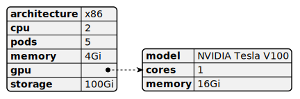

# K8slice-configuration

[Show schema SVG](../../svg/models/schemas/configuration-types/k8slice-configuration.svg)

- **cpu**. The number of CPU cores [string]
- **pods**. The number of pods [string]
- **memory**. The amount of memory [string]
- **gpu**:
  - **model**. The model of the GPU offered for the specific Flavor. [string]
  - **cores**. The number of GPU cores advertised by the Flavor. [string]
  - **memory**. The amount of GPU memory advertised by the Flavor. [string]
- **storage**. The amount of storage [string]