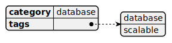

# Service-configuration

[Show schema SVG](../../svg/models/schemas/configuration-types/service-configuration.svg)

- **HostingPolicy**. Hosting policy chosen for the service once deployed. It needs to be one of the hosting policies associated with the flavor. [string]
- **ConfigurationData**. Configuration parameters for the service. It needs to match the JSON Schema Parameters associated with the flavor. [string]