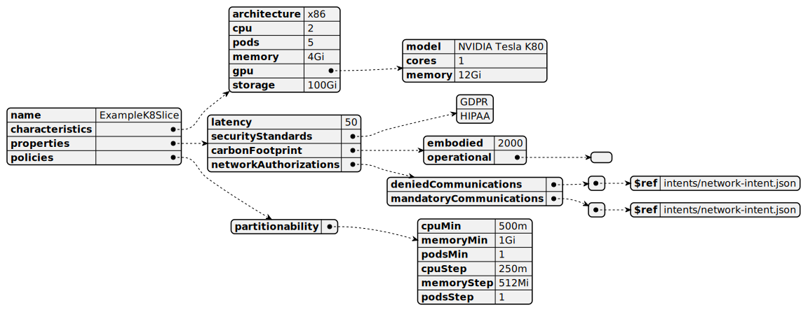

# K8slice

[Show schema SVG](../../svg/models/schemas/flavor-types/k8slice.svg)

- **characteristics**:
  - **cpu**. The number of CPU cores [string]
  - **pods**. The number of pods [string]
  - **memory**. The amount of memory [string]
  - **gpu**:
    - **model**. The model of the GPU offered for the specific Flavor. [string]
    - **cores**. The number of GPU cores advertised by the Flavor. [string]
    - **memory**. The amount of GPU memory advertised by the Flavor. [string]
  - **storage**. The amount of storage [string]
- **properties**:
  - **latency**. The latency of the Flavor in milliseconds. [integer]
  - **securityStandards**. Security standards supported by the Flavor (e.g., GDPR). [array]
  - **carbonFootprint**:
    - **embodied**. Embodied carbon of the node hardware normalized by its expected lifetime. [integer]
    - **operational**. Forecasted average carbon intensity of the node for the next N windows/hours. [array]
- **policies**:
  - **partitionability**:
    - **cpuMin**. Minimum required number of CPU cores of the Flavor for the eventual partition. [string]
    - **memoryMin**. Minimum required amount of RAM of the Flavor for the eventual partition. [string]
    - **podsMin**. Minimum required number of pods of the Flavor for the eventual partition. [string]
    - **cpuStep**. Incremental value of CPU cores of the Flavor for the eventual partition. [string]
    - **memoryStep**. Incremental value of RAM of the Flavor for the eventual partition. [string]
    - **podsStep**. Incremental value of pods of the Flavor for the eventual partition. [string]