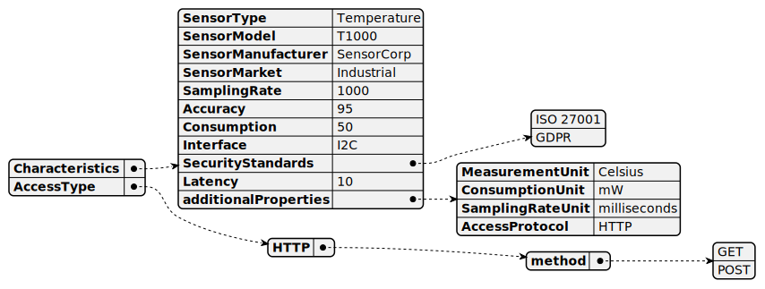

# Sensor

[Show schema SVG](../../svg/models/schemas/flavor-types/sensor.svg)

- **Characteristics**:
  - **SensorType**. The type of sensor [string]
  - **SensorModel**. The model of sensor [string]
  - **SensorManufacturer**. The manufacturer of sensor [string]
  - **SensorMarket**. The market of sensor [string]
  - **SamplingRate**. The sampling rate of the sensor in milliseconds [integer]
  - **Accuracy**. The accuracy reported for the measurements (unit percentage) [integer]
  - **Consumption**. The power consumption of the reported sensor (unit mW) [integer]
  - **Interface**. Not clear what that means. [string]
  - **SecurityStandards**. Security standards supported by the Flavor (e.g., GDPR). [array]
  - **Latency**. The latency of the Flavor. [integer]
  - **additionalProperties**:
    - **MeasurementUnit**. The unit of measure for the measurements [string]
    - **ConsumptionUnit**. The unit of measure for the sensor power consumption [string]
    - **SamplingRateUnit**. The unit of measure for the sampling rate [string]
    - **AccessProtocol**. Not sure what that means [string]
- **AccessType**. The access type of the sensor. Currently, HTTP and MQTT are supported.