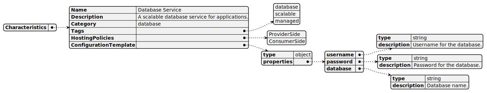

# Service

[Show schema SVG](../../svg/models/schemas/flavor-types/service.svg)

- **Characteristics**:
  - **Name**. Name of the flavor. [string]
  - **Description**. Description of the flavor. [string]
  - **Category**. Category of the flavor. [string]
  - **Tags**. Tags associated with the flavor. [array]
  - **HostingPolicies**. Hosting policies associated with the flavor. Where the service can be hosted once deployed. [array]
  - **ConfigurationTemplate**. JSON Schema Parameters [string]