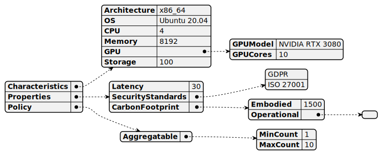

# Vm

[Show schema SVG](../../svg/models/schemas/flavor-types/vm.svg)

- **Characteristics**:
  - **Architecture**. Architecture of the Flavor. [string]
  - **OS**. The Operating System of the advertised VM [string]
  - **CPU**. Number of CPU cores of the Flavor. [integer]
  - **Memory**. Amount of RAM of the Flavor. [integer]
  - **GPU**:
    - **GPUModel**. The model of the GPU offered for the specific Flavor. [string]
    - **GPUCores**. The number of GPU cores advertised by the Flavor. [integer]
  - **Storage**. The amount of storage [integer]
- **Properties**:
  - **Latency**. The latency of the Flavor. [integer]
  - **SecurityStandards**. Security standards supported by the Flavor (e.g., GDPR). [array]
  - **CarbonFootprint**:
    - **Embodied**. Embodied carbon of the node hardware normalized by its expected lifetime. [integer]
    - **Operational**. Forecasted average carbon intensity of the node for the next N windows/hours. [array]
- **Policy**:
  - **Aggregatable**:
    - **MinCount**. Minimum required number of instances of the Flavor. [integer]
    - **MaxCount**. Maximum required number of instances of the Flavor. [integer]